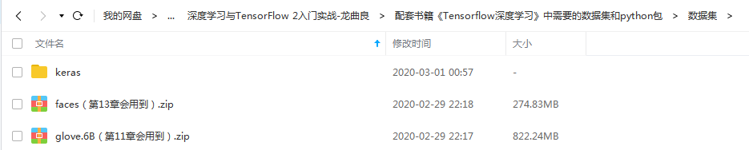

# TensorFlow深度学习练习代码
&emsp;&emsp;龙龙（龙曲良）老师的《TensorFlow深度学习》是TensorFlow2.0入门教材之一。  
&emsp;&emsp;本书共15章，大体上可分为4个部份：第1-3章为第1部分，主要介绍人工智能的初步认知，并引出相关问题；第4-5章为第2部分，主要介绍TensorFlow相关基础，为后续算法实现铺垫；第6-9章为第3部分，主要介绍神经网络的核心理论和共性知识，让读者理解深度学习的本质；第10-15章为模型算法应用部分，主要介绍常见的算法与模型，让读者能够学有所用。  
&emsp;&emsp;**申明：** 所有的代码都来源于《TensorFlow深度学习》，github地址：https://github.com/dragen1860/Deep-Learning-with-TensorFlow-book。

## 使用说明
1. 本练习代码是搭配龙龙老师的《TensorFlow深度学习》一书。
2. 关于本笔记中的练习代码，已经消缺了书中代码的错误，可以很方便地执行程序。  
3. 关于书中的很多图，已经写好了生成数据图的代码，在对应的目录下也有数据图。
4. 关于书中很多用jupyter notebook写的代码示例，也在对应的目录下有对应章节的ipynb文档。
5. 关于python包的版本问题，请详见requirements.txt文件，笔者采用的tensorflow-gpu==2.0.0，可以使用cpu版本，但是运行会特别慢。
5. 相关数据集和gym包，百度网盘的下载地址：链接：https://pan.baidu.com/s/1fZ748Xz3WrgQnIaxGsrZLQ，提取码：ea6u  

&emsp;&emsp;使用windows平台的tensorflow，将keras中的datasets和models放入到C:\Users\{pcUserName}\.keras路径下，其他的数据包，在对应的练习代码中有说明。

## 选用的《TensorFlow深度学习》版本

> 书名：TensorFlow深度学习 
> 作者：龙龙老师 
> 版次：2019年12月05日测试版第2版 

## 主要贡献者（按首字母排名）
[@胡锐锋-天国之影-Relph](https://github.com/Relph1119)

## 总结
&emsp;&emsp;本书总共用了16天（2020年2月14日-2020年3月1日）阅读完，对TensorFlow和Keras的使用有很大的收获，其中第11、13章由于电脑的显卡不好，不能完成练习，第15章的代码还未整理，缺少pokemon（梦可宝）的数据集，其他章节的练习均完成了。  
  
**注意：** 如果出现以下这个错误，说明显卡的显存太低，可以将代码和数据集放到Google Colab上面执行。
> tensorflow.python.framework.errors_impl.ResourceExhaustedError: OOM when allocating tensor with shape[500,500,500] and type float on /job:localhost/replica:0/task:0/device:GPU:0 by allocator GPU_0_bfc [Op:Sub] name: sub/  

## LICENSE
[GNU General Public License v3.0](https://github.com/relph1119/deeplearning-with-tensorflow-notes/blob/master/LICENSE)