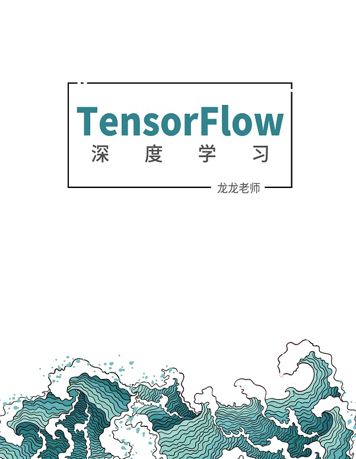

# TensorFlow深度学习练习代码
&emsp;&emsp;龙龙（龙曲良）老师的《TensorFlow深度学习》是TensorFlow2.0入门教材之一。  
&emsp;&emsp;本书共15章，大体上可分为4个部份：第1~3章为第1部分，主要介绍人工智能的初步认知，并引出相关问题；第4~5章为第2部分，主要介绍TensorFlow相关基础，为后续算法实现铺垫；第6~9章为第3部分，主要介绍神经网络的核心理论和共性知识，让读者理解深度学习的本质；第10~15章为模型算法应用部分，主要介绍常见的算法与模型，让读者能够学有所用。
&emsp;&emsp;**申明：** 所有的代码都来源于《TensorFlow深度学习》。

## 使用说明
&emsp;&emsp;本练习代码是搭配龙龙老师的《TensorFlow深度学习》一书。

## 选用的《统计学习方法》版本

> 书名：TensorFlow深度学习 
> 作者：龙龙老师 
> 版次：2019年12月05日测试版第2版 

## 主要贡献者（按首字母排名）
 [@胡锐锋-天国之影-Relph](https://github.com/Relph1119)

## LICENSE
[GNU General Public License v3.0](https://github.com/relph1119/deeplearning-with-tensorflow-notes/blob/master/LICENSE)